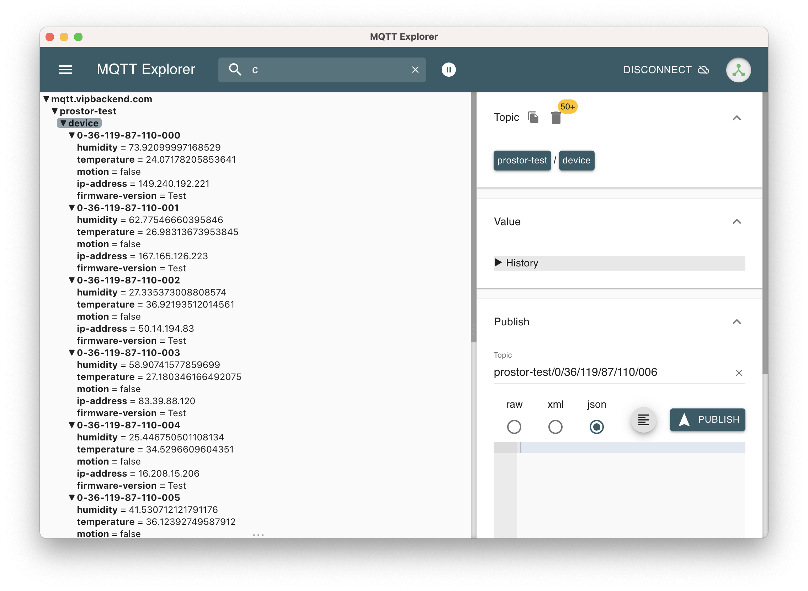

# Tibulator
[](https://www.npmjs.com/package/tibulator)

Probably the shittiest package known to man


## Usage
```shell
$ npx tibulator ./tibulator.json
```

## Configuration

Example of `tibulator.json`
```json
{
  "deviceCount": 10,
  "firmwareVersion": "1.0",
  "firmwareName": "Test",
  "scanRate": 10000,
  "sensors": [
    {
      "type": "HUMIDITY"
    },
    {
      "type": "TEMPERATURE"
    }
  ],
  "inputs": [
    {
      "name": "motion",
      "probability": "never"
    }
  ],
  "mqtt": {
   "options": {
     "url": "mqtt://mqtt.vipbackend.com",
     "username": "prostor-api",
     "password": "password"
   },
    "rootTopic": "prostor-test"
  }
}
```

## Example

