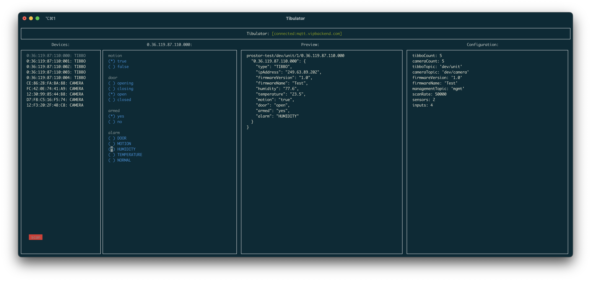

# Tibulator
[](https://www.npmjs.com/package/tibulator)



Probably the shittiest package known to man


## Changelog
### 0.1.6
* Changes device properties emission to single topic, comma-separated

### 0.1.5
* Ensures inputs not being modified are still emitting

### 0.1.4
* Removes submit button
* Fixes live data

### 0.1.3
* Bugfixes

### 0.1.2
* Entirely re-works how TUI works
* Adds `initialValue` to inputs and sensors

### 0.1.1
* Adds `locationID` to topic/config

### 0.1.0
* `Input` is now `RandomInput` or `ArrayInput` depending on how you've configured the input (see example)

### 0.0.9
* Improves example box on the right
* Adds options for `cameraTopic`, `deviceTopic`, and `managementTopic`
* Splits up CLI for later improvements

### 0.0.8
* Emits scan date

### 0.0.7
* Adds click to scan in TUI

### 0.0.6
* New TUI

### 0.0.5
* Added Camera device
* Fixed emissionRate bug
* Adds ws-discover util

### 0.0.4
* Mapping of Input values

### 0.0.3
* Spawns MQTT client for each device

### 0.0.2
* Increases max device count

### 0.0.1
* Initial commit

## Usage
```shell
$ npx tibulator ./tibulator.json
```

## Configuration

Example of `tibulator.json`
```json
{
  "locationID": 1,
  "tibboCount": 0,
  "tibboTopic": "dev/unit",
  "cameraCount": 0,
  "cameraTopic": "dev/camera",
  "firmwareVersion": "1.0",
  "firmwareName": "Test",
  "scanRate": 50000,
  "sensors": [
    {
      "type": "HUMIDITY"
    },
    {
      "type": "TEMPERATURE",
      "emissionRate": 10000
    }
  ],
  "inputs": [
    {
      "name": "motion",
      "probability": 0.5
    },
    {
      "name": "door",
      "values": ["opening", "closing", "open", "closed"]
    },
    {
      "name": "armed",
      "probability": 0.5,
      "trueValue": "yes",
      "falseValue": "no",
      "initialValue": "yes"
    },
    {
      "name": "alarm",
      "values": ["DOOR", "MOTION", "HUMIDITY", "TEMPERATURE", "NORMAL"],
      "initialValue": "NORMAL"
    }
  ],
  "mqtt": {
   "options": {
     "url": "mqtt://mqtt.vipbackend.com",
     "username": "prostor-api",
     "password": "password"
   },
    "rootTopic": "prostor-test"
  }
}
```

## Example


